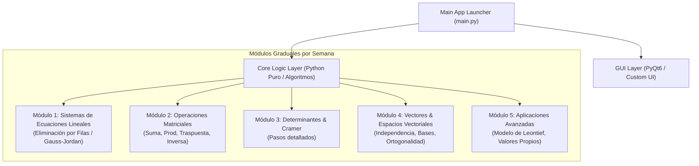

# Plan de Arquitectura: Nueva Calculadora de Álgebra Lineal (UAM)

Construcción de una nueva calculadora modular, moderna y robusta para la asignatura de **Álgebra Lineal (UAM)**, utilizando **MenuA** como base de referencia conceptual para extraer, rediseñar y superar sus módulos conforme avanza el semestre.

---

## User Review Required

> [!IMPORTANT]
> **Nombre del Proyecto y Ubicación**: Se propone crear el proyecto en `C:\Users\lxman\Documents\Calculadora_Algebra_Lineal`.
> **Tecnología UI**: Proponemos usar **PyQt6** con un motor de temas moderno y limpio (estilo tarjeta/dashboard con modo oscuro/claro) que supere el diseño clásico de MenuA.
> **Separación Estricta de Lógica y GUI**: Para las tareas del docente que prohíban `NumPy` (como la Tarea 1), los motores lógicos serán 100% Python puro en la capa `core/`, mientras que la interfaz gráfica en `gui/` presentará los resultados de forma interactiva con pasos explicativos.

---

## Estrategia de Modularización (Semana a Semana)



---

## Estructura del Código Propuesto

```
Calculadora_Algebra_Lineal/
├── main.py                          # Punto de entrada principal
├── requirements.txt                 # Dependencias del proyecto (PyQt6, etc.)
├── ejecutar.bat                     # Script de inicio rápido (Doble clic)
├── .vscode/                         # Configuración para ejecución automática con F5
│   ├── launch.json
│   └── settings.json
├── core/                            # Lógica Matemática (100% Python puro, sin librerías externas)
│   ├── __init__.py
│   ├── eliminacion_gaussiana.py    # Motor Tarea 1: Escalonamiento, pivoteo, clasificación
│   ├── matrices.py                  # Próximas semanas: Inversa, producto, operaciones
│   └── verificador.py               # Comprobación de soluciones (Ax = b)
├── gui/                             # Interfaz Gráfica (Moderna, elegante y responsiva)
│   ├── __init__.py
│   ├── main_window.py               # Dashboard / Menú principal con barra lateral
│   ├── styles.py                    # Estilos CSS / QSS (Modo Oscuro / Azul UAM)
│   └── modules/                     # Vistas / Paneles interactivos por módulo
│       ├── base_module.py
│       └── ecuaciones_widget.py     # Interfaz interactiva de la Tarea 1
└── utils/                           # Exportación e impresiones
    ├── __init__.py
    └── exporter.py                  # Generación de informes / LaTeX / Paso a paso
```

---

## Fase 1: Implementación del Módulo 1 (Tarea 1 Actual)

### 1. Motor Lógico (`core/eliminacion_gaussiana.py`)
- Algoritmo de eliminación por filas con **Pivoteo Parcial** y **Normalización a 1**.
- Impresión y retorno estructurado de cada paso del escalonamiento (para visualización gráfica paso a paso).
- Clasificación estricta:
  - **Sistema Consistente Determinado** (Solución única por sustitución hacia atrás).
  - **Sistema Consistente Indeterminado** (Infinitas soluciones, identificando variables libres y básicas).
  - **Sistema Inconsistente** (Sin solución, identificando filas del tipo $0 = c$).
- Verificación automática de la solución contra el sistema original.

### 2. Vista Interactiva (`gui/modules/ecuaciones_widget.py`)
- Selector dinámico del tamaño del sistema ($m$ ecuaciones $\times$ $n$ variables).
- Tabla interactiva para la matriz aumentada $[A|b]$ con validación de entradas numéricas.
- Botón "Resolver Paso a Paso" que muestra:
  1. Matriz inicial.
  2. Historial animado/desplegable de operaciones de fila.
  3. Matriz en forma escalonada reducida.
  4. Resumen de clasificación y valores de variables.
  5. Tarjeta de Verificación ($Ax = b$).
- Botón "Exportar Paso a Paso" a texto/PDF para adjuntar como evidencia de tarea.

---

## Plan de Verificación

### Pruebas Automatizadas
1. **Prueba de Lógica Pura (Consola)**:
   - Ejecución de `core/eliminacion_gaussiana.py` con los 3 casos de la Tarea 1 (Solución Única, Infinitas Soluciones, Sin Solución).
2. **Prueba de GUI (PyQt6)**:
   - Verificación de renderizado de la ventana principal y tabla interactiva.
